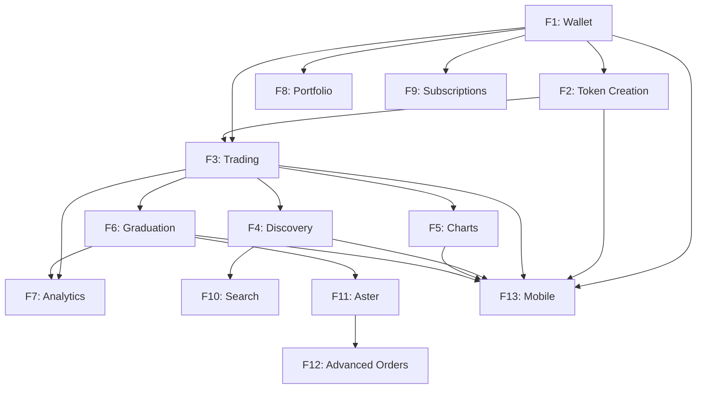

# Product Requirements Document (PRD)
## PumpBNB - BNB Chain Meme Coin Launchpad

**Version**: 2.0 (Enhanced)
**Last Updated**: October 10, 2025
**Status**: Specification Phase - Ready for Development
**Document Owner**: Product Team
**Development Start**: TBD

---

## Document Navigation

This PRD serves as the **source of truth** for PumpBNB development. It consolidates:

| Document | Purpose | Location |
|----------|---------|----------|
| **Mission.md** | Product vision, users, problems, differentiators | `agent-os/product/mission.md` |
| **Feature List** | Complete catalog of 13 features | `agent-os/product/feature-list.md` |
| **Feature Specs** | Detailed specifications for each feature | `agent-os/features/F1-F13-*.md` |
| **Roadmap** | Development timeline and dependencies | `agent-os/product/roadmap.md` |
| **Tech Stack** | Technology choices for all components | `agent-os/product/tech-stack.md` |
| **This Document (PRD)** | Executive summary and integration | `agent-os/product/PRD.md` |

---

## Executive Summary

### Product Overview

**PumpBNB** is a BNB Chain-based meme coin launchpad that enables instant token creation and trading through automated bonding curves, with automatic PancakeSwap graduation at $100K market cap and integrated 100x leverage trading.

**Core Value Proposition**: Bring Pump.fun's revolutionary fair-launch model to BNB Chain with enhanced features including seamless DEX integration and professional trading infrastructure.

### Key Metrics

| Metric | Month 3 | Month 6 | Month 12 |
|--------|---------|---------|----------|
| **Monthly Active Users** | 5,000 | 15,000 | 50,000 |
| **Tokens Created** | 500 | 2,000 | 5,000 |
| **Monthly Trading Volume** | $1M | $10M | $50M |
| **Platform Revenue** | $10K | $100K | $500K |

### Development Timeline

- **Phase 1** (Months 1-3): Core Platform - Features F1-F6
- **Phase 2** (Months 4-6): Enhanced Experience - Features F7-F10
- **Phase 3** (Months 7-9): Advanced Trading - Features F11-F13

**Total Development Time**: 9-12 months

---

## Problem Statement

### Market Opportunity

The meme coin market represents $50B+ in market cap with platforms like Pump.fun generating $800M+ in revenue. However, current solutions suffer from:

1. **Complex Launch Processes**: Multi-step deployments create scam opportunities
2. **Unfair Distribution**: Presales and insider allocations disadvantage communities
3. **Isolated Ecosystems**: Tokens trapped in proprietary systems with no growth path
4. **Limited Trading Tools**: Basic spot trading only, no leverage or advanced orders

### Target Users

1. **Meme Coin Creators** (Primary): 18-35, content creators and community leaders seeking fair-launch mechanisms
2. **Opportunity Hunters** (Primary): 22-40, active traders seeking early-stage opportunities
3. **Leverage Traders** (Secondary): 25-45, professional traders using advanced strategies
4. **Crypto Communities** (Secondary): Discord/Telegram groups coordinating token launches

---

## Solution Overview

### Core Features (Must-Have - Phase 1)

**F1: Wallet Connection**
- Multi-wallet support (MetaMask, Trust Wallet, Binance Chain Wallet)
- Auto-reconnect and session management
- Network switching to BNB Chain
- **Why Critical**: Foundation for all user interactions

**F2: Token Creation System**
- One-click BEP-20 deployment
- IPFS metadata storage
- Anti-bot protection
- **Why Critical**: Core product offering

**F3: Bonding Curve Trading**
- Linear bonding curve formula
- Instant buy/sell with 1% fee
- Slippage protection
- **Why Critical**: Enables trading and price discovery

**F4: Token Discovery & Feed**
- Real-time feed of new tokens
- Trending, gainers, graduation tracking
- WebSocket updates
- **Why Critical**: User acquisition and engagement

**F5: Real-time Price Charts**
- TradingView integration
- Multiple timeframes (1m-1d)
- Volume indicators
- **Why Critical**: Professional trading experience

**F6: PancakeSwap Graduation**
- Automatic migration at $100K market cap
- Liquidity preservation
- Creator allocation unlock
- **Why Critical**: Long-term token sustainability

### Advanced Features (Should-Have - Phase 2)

**F7: Analytics Dashboard** - Token and platform metrics
**F8: Portfolio Management** - Holdings tracking and P&L
**F9: Premium Subscriptions** - Monetization ($10-100/month)
**F10: Search & Filtering** - Advanced token discovery

### Differentiating Features (Nice-to-Have - Phase 3)

**F11: Aster Protocol Integration** - 100x leverage trading
**F12: Advanced Order Types** - Limit, stop-loss, take-profit
**F13: Mobile Application** - Native iOS and Android apps

---

## Technical Architecture

### Technology Stack Summary

| Layer | Technology | Rationale |
|-------|-----------|-----------|
| **Smart Contracts** | Solidity 0.8.19, Hardhat | Industry standard, mature tooling |
| **Blockchain** | BNB Chain (BSC) | Lower costs, larger ecosystem |
| **Frontend** | Next.js 14, TypeScript | Modern, performant, SEO-friendly |
| **Web3** | Wagmi + Viem | Type-safe, modern Web3 library |
| **Backend** | Node.js, Express | JavaScript full-stack |
| **Database** | PostgreSQL, MongoDB | Relational + document store |
| **Cache** | Redis | Performance optimization |
| **Charts** | TradingView Lightweight | Professional-grade charting |
| **Mobile** | React Native | Cross-platform code reuse |
| **Storage** | IPFS (Pinata) | Decentralized metadata storage |

### Smart Contract Architecture

```
TokenFactory.sol (Deploys tokens)
    ↓
MemeToken.sol (BEP-20 token)
    ↓
BondingCurve.sol (Trading mechanism)
    ↓
GraduationManager.sol (PancakeSwap migration)
    ↓
PancakeSwap V2 (Decentralized liquidity)

[Phase 3]
    ↓
AsterIntegration.sol (Leverage trading)
```

### System Components

1. **Smart Contracts** (Blockchain Layer)
   - TokenFactory, BondingCurve, GraduationManager
   - PancakeSwap integration
   - Aster Protocol integration (Phase 3)

2. **Backend Services** (Application Layer)
   - API endpoints (Express.js)
   - Real-time updates (WebSocket)
   - Price aggregation (cron jobs)
   - IPFS integration (Pinata)

3. **Frontend Application** (Presentation Layer)
   - Next.js web application
   - React Native mobile app (Phase 3)
   - TradingView charts
   - Wallet integration

4. **Data Layer**
   - PostgreSQL (transactions, users)
   - MongoDB (token metadata)
   - Redis (caching, real-time data)

---

## Development Methodology

### Parallel Development Strategy

**13 features organized into 3 phases** with parallel workstreams enabling simultaneous development:

**Phase 1 Parallel Work:**
- Workstream A: F1 (Wallet) → F2 Frontend → F4 Frontend
- Workstream B: F2 Contracts → F3 Contracts → F6 Contracts
- Workstream C: F5 (Charts) → Independent UI work

**Phase 2 Parallel Work:**
- Workstream A: F7 (Analytics)
- Workstream B: F8 (Portfolio)
- Workstream C: F9 (Subscriptions), F10 (Search)

**Phase 3 Parallel Work:**
- Workstream A: F11, F12 (Aster + Orders)
- Workstream B: F13 (Mobile - independent)

### Feature Dependencies



---

## User Experience

### Core User Flows

#### Flow 1: Token Creator Journey

```
1. User connects wallet (F1)
   ↓
2. Clicks "Create Token"
   ↓
3. Fills form:
   - Name: "Doge Killer"
   - Symbol: "DOGK"
   - Description
   - Uploads image
   ↓
4. Reviews creation fee ($0.10)
   ↓
5. Confirms transaction in wallet
   ↓
6. Token deployed (~5 seconds)
   ↓
7. Token appears in feed (F4)
   ↓
8. Creator shares on social media
   ↓
9. Community starts trading (F3)
```

**Success Metric**: < 5 minutes from idea to tradeable token

#### Flow 2: Early Trader Journey

```
1. Visits platform homepage
   ↓
2. Browses recent/trending tokens (F4)
   ↓
3. Clicks on "Doge Killer" token
   ↓
4. Views price chart (F5)
   ↓
5. Checks holder distribution (F7)
   ↓
6. Decides to buy
   ↓
7. Connects wallet (F1)
   ↓
8. Enters BNB amount
   ↓
9. Reviews price impact & fees
   ↓
10. Confirms trade (F3)
   ↓
11. Tokens appear in wallet
   ↓
12. Adds to portfolio (F8)
```

**Success Metric**: < 60 seconds from discovery to trade

#### Flow 3: Graduation Journey (Automatic)

```
1. Token reaches $99K market cap
   ↓
2. Final buy pushes to $100K
   ↓
3. GraduationManager detects threshold
   ↓
4. Bonding curve trading paused
   ↓
5. Liquidity extracted from curve
   ↓
6. PancakeSwap pair created
   ↓
7. Liquidity added to PancakeSwap
   ↓
8. Creator allocation unlocked
   ↓
9. Status updated to "Graduated"
   ↓
10. Users notified
   ↓
11. Trading continues on PancakeSwap
```

**Success Metric**: < 30 seconds total graduation time

---

## Business Model

### Revenue Streams

| Revenue Source | Rate | Estimated % of Revenue |
|----------------|------|----------------------|
| **Trading Fees** | 1% per transaction | 80% |
| **Token Creation** | $0.10 per token | 5% |
| **Graduation Fees** | Platform absorbs cost | N/A |
| **Premium Subscriptions** | $10-100/month | 7% |
| **API Access** | Usage-based | 3% |
| **Aster Revenue Share** | 20% of fees | 5% (Phase 3) |

### Financial Projections

**Year 1 (Conservative Scenario):**
- Monthly Trading Volume (Month 12): $50M
- Monthly Revenue: $500K (1% of $50M)
- Monthly Costs: $65K
- Monthly Profit: $435K
- Annual Revenue: ~$3M
- Annual Profit: ~$2M

**Break-Even**: Month 3-4 at $5M monthly volume

---

## Success Criteria

### Phase 1 Success (Month 3)
- [ ] All 6 core features (F1-F6) functional
- [ ] 500+ tokens created
- [ ] 5,000+ monthly active users
- [ ] $1M+ monthly trading volume
- [ ] 99.9% uptime
- [ ] 2 security audits passed
- [ ] Zero critical security incidents

### Phase 2 Success (Month 6)
- [ ] Advanced features (F7-F10) deployed
- [ ] 15,000+ monthly active users
- [ ] $10M+ monthly trading volume
- [ ] > 5% premium subscription conversion
- [ ] Break-even or profitable
- [ ] Mobile-optimized experience

### Phase 3 Success (Month 9)
- [ ] Aster integration live (F11-F12)
- [ ] Mobile app launched (F13)
- [ ] 50,000+ monthly active users
- [ ] $50M+ monthly trading volume
- [ ] > 10% leverage adoption
- [ ] #1 BSC meme coin launchpad

---

## Risk Assessment

### Technical Risks

| Risk | Probability | Impact | Mitigation |
|------|-------------|--------|-----------|
| **Smart Contract Vulnerabilities** | Medium | Very High | 2 independent audits, $100K bug bounty |
| **Aster Integration Complexity** | Medium | High | 2-week research sprint, buffer time |
| **PancakeSwap API Changes** | Low | Medium | Well-documented stable API |
| **Scalability Issues** | Medium | High | Load testing, auto-scaling infrastructure |

### Market Risks

| Risk | Probability | Impact | Mitigation |
|------|-------------|--------|-----------|
| **Pump.fun Launches on BSC** | Medium | High | First-mover advantage, superior features |
| **Regulatory Changes** | Low | High | Geo-restrictions, legal compliance |
| **Market Downturn** | High | Medium | Cost flexibility, diversified revenue |
| **User Adoption Slower** | Medium | Medium | Aggressive marketing, referral programs |

### Mitigation Budget

- **Security**: $150K annually (audits, bounties)
- **Legal/Compliance**: $40K annually
- **Insurance Reserves**: 10% of revenue

---

## Competitive Analysis

### vs. Pump.fun (Solana)

| Feature | Pump.fun | PumpBNB | Winner |
|---------|----------|---------|---------|
| **Token Creation** | ✅ Instant | ✅ Instant | Tie |
| **Bonding Curve** | ✅ Yes | ✅ Yes | Tie |
| **Fair Launch** | ✅ Yes | ✅ Yes + Locked Creator | **PumpBNB** |
| **Charts** | ⚠️ Basic | ✅ TradingView | **PumpBNB** |
| **DEX Integration** | ⚠️ Proprietary | ✅ PancakeSwap | **PumpBNB** |
| **Mobile App** | ❌ No | ✅ React Native | **PumpBNB** |
| **Leverage** | ❌ No | ✅ 100x | **PumpBNB** |
| **Advanced Orders** | ❌ No | ✅ Yes | **PumpBNB** |
| **Portfolio** | ⚠️ Basic | ✅ Advanced | **PumpBNB** |
| **API Access** | ❌ No | ✅ Yes | **PumpBNB** |
| **Network** | Solana | BNB Chain | Context-dependent |

### Unique Differentiators

1. **Automatic PancakeSwap Integration**: Unlike Pump.fun's proprietary Pump Swap
2. **100x Leverage Trading**: Via Aster Protocol (Phase 3)
3. **Advanced Order Types**: Limit, stop-loss, take-profit
4. **Native Mobile App**: Full-featured iOS and Android
5. **Professional Analytics**: Advanced metrics and tracking
6. **BNB Chain Advantages**: Lower barriers, larger ecosystem

---

## Security & Compliance

### Smart Contract Security

**Pre-Mainnet Requirements:**
1. 95%+ test coverage (Hardhat/Foundry)
2. Minimum 2 independent audits
3. $100K bug bounty program
4. Formal verification for critical functions
5. Testnet deployment with public testing

**Post-Mainnet:**
1. Continuous monitoring
2. Emergency pause mechanisms
3. Multi-sig admin controls
4. Smart contract insurance (if available)
5. Quarterly security reviews

### Compliance

1. **Terms of Service**: Clear user agreements
2. **Privacy Policy**: GDPR and CCPA compliant
3. **AML/KYC**: For high-volume users if required
4. **Geographic Restrictions**: Capability built-in
5. **Legal Entity**: BVI or similar crypto-friendly jurisdiction

---

## Go-to-Market Strategy

### Pre-Launch (Months 1-2)

**Community Building:**
- Twitter/X account with daily updates
- Discord server for early adopters
- Telegram channel for announcements
- Medium articles on development

**Partnership Development:**
- Wallet integrations (MetaMask, Trust, Binance)
- BSC ecosystem partnerships
- Crypto influencer relationships

### Launch (Month 3)

**Soft Launch:**
- Beta testing with 100 selected users
- Limited token creation (10/day)
- Bug fixes and improvements

**Public Launch:**
- Full platform availability
- Marketing campaign: "Pump.fun Comes to BSC"
- Influencer partnerships activate
- Community contests and rewards

### Post-Launch (Months 4-6)

**Growth Acceleration:**
- Referral program (0.1% fee reduction)
- Premium features introduction
- Strategic partnerships
- Content marketing

---

## Documentation Structure

### For Developers

Each feature has detailed specifications in `agent-os/features/`:

- **F1-wallet-connection.md**: Wallet integration specs
- **F2-token-creation.md**: Token deployment specs
- **F3-bonding-curve-trading.md**: Trading mechanism specs
- **F4-token-discovery.md**: Feed and discovery specs
- **F5-price-charts.md**: Chart integration specs
- **F6-pancakeswap-graduation.md**: Graduation specs
- **F7-analytics-dashboard.md**: Analytics specs
- **F8-portfolio-management.md**: Portfolio specs
- **F9-premium-subscriptions.md**: Subscription specs
- **F10-search-filtering.md**: Search specs
- **F11-aster-integration.md**: Leverage trading specs
- **F12-advanced-orders.md**: Order types specs
- **F13-mobile-app.md**: Mobile application specs

### For Product Team

- **mission.md**: Product vision and strategy
- **feature-list.md**: Complete feature catalog
- **roadmap.md**: Development timeline
- **tech-stack.md**: Technology decisions
- **PRD.md** (this document): Executive summary

---

## Next Steps

### Immediate Actions (Pre-Development)

1. [ ] **Review & Approve PRD**: Stakeholder sign-off on this document
2. [ ] **Review All Feature Specs**: Ensure F1-F13 specs are complete
3. [ ] **Finalize Tech Stack**: Lock technology choices
4. [ ] **Set Up Development Environment**: GitHub repo, CI/CD, tools
5. [ ] **Hire Core Team**: Lead developer, smart contract developer, frontend developer

### Week 1 (Development Kickoff)

1. [ ] **Sprint Planning**: Plan Sprint 1-2 (F1, F2, F3 contracts)
2. [ ] **Repository Setup**: Smart contract and frontend repos
3. [ ] **Development Environment**: Local testnet, Hardhat setup
4. [ ] **Team Onboarding**: Review all documentation

### Month 1 Milestones

1. [ ] F1 (Wallet Connection) - Complete
2. [ ] F2 (Token Creation Contracts) - Complete
3. [ ] F3 (Bonding Curve Contracts) - 50% Complete
4. [ ] Testnet deployment of F1, F2

---

## Appendix

### Glossary

- **Bonding Curve**: Mathematical pricing formula that increases token price as supply decreases
- **BEP-20**: Binance Smart Chain token standard (equivalent to ERC-20)
- **DEX**: Decentralized Exchange
- **Fair Launch**: Token launch with no presales or early allocations
- **Graduation**: Automatic migration from bonding curve to PancakeSwap
- **IPFS**: InterPlanetary File System (decentralized storage)
- **LP Tokens**: Liquidity Provider tokens representing share of liquidity pool
- **Slippage**: Difference between expected and actual trade price
- **WebSocket**: Protocol for real-time bidirectional communication

### References

- **Original project.md**: `F:\Andrius\BNB_PumpFun\project.md`
- **Research documents**: `F:\Andrius\BNB_PumpFun\research/`
- **CLAUDE.md**: `F:\Andrius\BNB_PumpFun\CLAUDE.md`
- **Pump.fun background**: `F:\Andrius\BNB_PumpFun\Info.txt`

---

**Document Status**: ✅ **APPROVED FOR DEVELOPMENT**

**Approval Required From:**
- [ ] Product Lead
- [ ] Technical Lead
- [ ] Business Lead
- [ ] Legal/Compliance

**Approval Date**: ___________

**Development Start Date**: ___________

---

*This PRD is a living document. Updates should be versioned and communicated to all stakeholders.*
